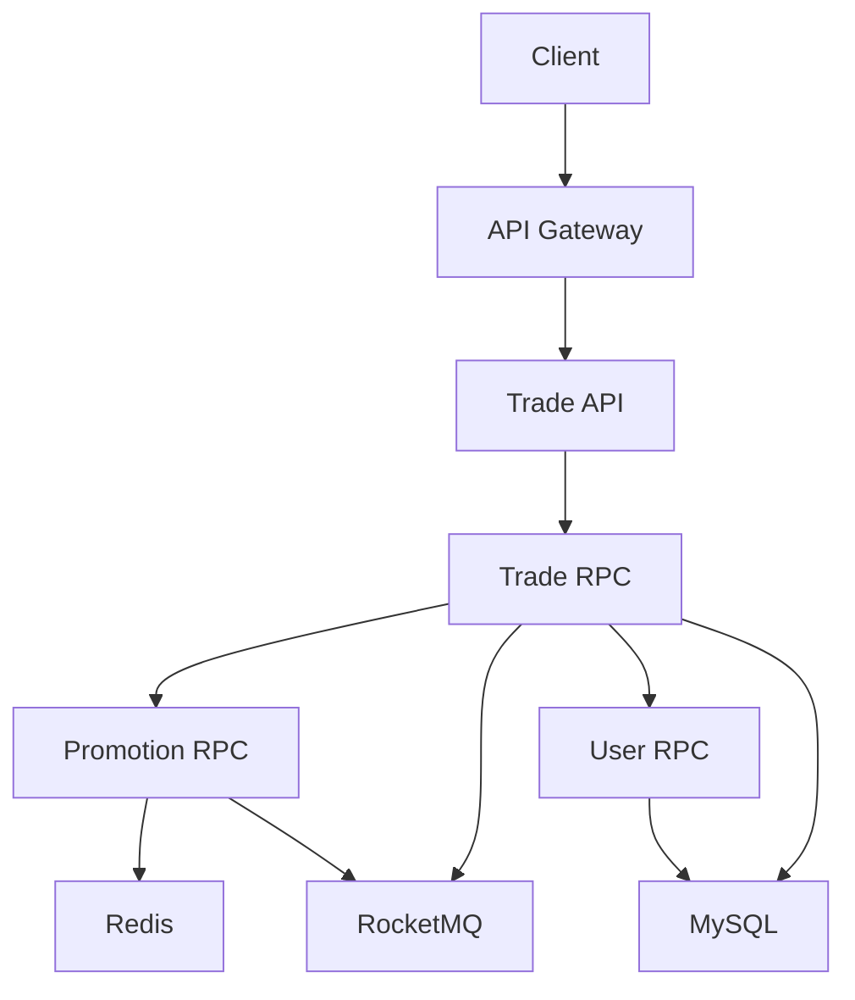

# Aether Defense System Architecture Diagram

## Overall Architecture

## Component Description

### API Gateway

- Responsible for request routing, authentication, and rate limiting
- Implemented using Go-Zero framework

### Trade API

- Provides HTTP interface for client calls
- Processes order placement requests
- Communicates with Trade RPC via gRPC

### Trade RPC

- Core trading service
- Responsible for order creation and RocketMQ transaction message sending
- Calls Promotion RPC to deduct inventory
- Calls User RPC to verify user information

### Promotion RPC

- Marketing service
- Responsible for high-concurrency inventory deduction
- Implements atomic operations using Redis + Lua

### User RPC

- User service
- Provides user information query functionality

### Redis

- Caches inventory data
- Executes Lua scripts to implement atomic inventory deduction

### RocketMQ

- Asynchronously processes order creation and inventory deduction
- Implements eventual consistency

### MySQL

- Persistently stores order and user data
